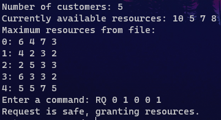
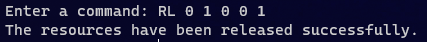
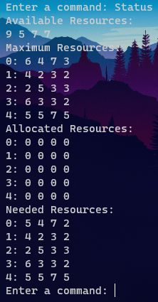
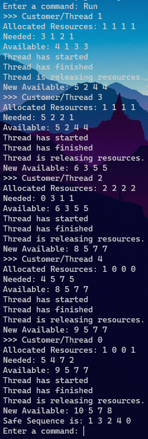

# Banker's Algorithm
Multithreaded code that implements the Banker's Algorithm. Customers request and release resources from the bank, and the banker keeps track of these resources. The banker will grant the request if it satisfies the safety algorithm.
## Motivation

## Installation

## Screenshots

## Contributions
### Riley's Contribution
* Implemented main function
* Implemented read_file function
* Implemented customer_init function
* Implemented request_resources function
* Implemented run_safety_algorithm function
### Torin's Contribution
* Implemented main function
* Implemented release_resources function
* Implemented request_resources_safety function
* Implemented release_resources_safety function

## Features
* Available resources are inputted by the user via command line
* Handles manual resource request and release commands
    * Command structure follows the pattern of:
        * "RQ x x x ... x" -> where the number of x's is the number of resources
        * "RL x x x ... x" -> where the number of x's is the number of resources
* "Status" command displays maximum, allocated and needed resources for each customer as well as the resources available to all of them
* "Run" command runs the safe sequence algorithm with the system in its current state 

## Tests
### Resource Request Test

* The 0 immediately after the "RQ" is the customer (customer_id) making the request
* The 4 digits after the customer_id is the number of each resource being requested, seperated by spaces
### Resource Release Test

* The 0 immediately after the "RL" is the customer (customer_id) making the request
* The 4 digits after the customer_id is the number of each resource being requested, seperated by spaces
### Resource Status Test

* The command displays the resources available to all customers, and then the maximum, allocated, and needed resources for each customer
* Each customers maximum, allocated and needed resources is represented by a row that follows the format: "customer_id: x x x ... x
### Run Test

* The safety algorithm will run through each thread that can be allocated resources and display its allocated and needed resources, as well as the resources currently available
* Once every thread has been given the resources it needs, it will display the safe sequence of resource allocation
* It will otherwise say "No possible safe sequence!" if it cannot allocate resources to ALL customers
## Code Example

## Authors
Riley Adams - adam6070@mylaurier.ca

Torin Borton-McCallum - bort4620@mylaurier.ca

## Credits

## License
MIT License -> See the LICENSE file for details.
